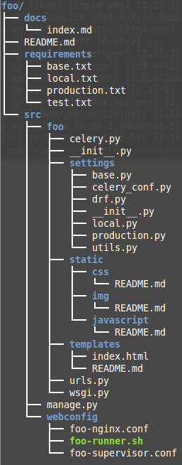

template-geodjango
==================

This is a helper template to get started with GeoDjango and a few other libraries that
we end up using a lot here at sigma-geosistemas.

This consists of:

* django;
* django.contrib.gis;
* psycopg2;
* djangorestframework;
* djangorestframework-gis;
* celery;
* redis;

## What does this template do?

This template set's up a few things for you, such as:

* requirements separated by environment type;
* settings separated by environment type;
* settings configured using environment variables, for a more secure deploy;
* sample nginx configuration;
* sample shell script for running the django application;
* sample supervisor script for watching over the application, with the user of environment variables for deploy;
* creates a generic index.html, located in ```<project_name>/templates``` folder and it's URL;

## What this template does not do for you?

* Fully configure nginx, supervisor and the shell runner - you should fill in details yourself!;
* This template will generate a lot of unwanted stuff. For example, this README.md, all the docs folders will be in the new project. You might want to take a look and remove them **before** commiting.

## To Do

* Samples for celery worker and celery beat;
* Lot's of other stuff;

# Usage

To use this is pretty simple. First of all, create your virtualenv:

```bash
cd ~/projetos/.virtualenvs/
virtualenv <project_name>
```

If you are using virtualenvwrapper and it's properly configured, just do:

```bash
mkvirtualenv <project_name>
```

Take into account where you are storing your virtualenvs folder, in case of not using virtualenvwrapper. ```<project_name>``` should be replaced by your, humn, project name. For 'foo' project:

```bash
mkvirtualenv foo
```

Install the desired version of Django (it should be higher equal or higher then 1.4, before that we did not have the template option on startproject).

```bash
pip install Django==<version>
```

Since this template scaffolds a lot of other things that are not just Django related,
like docs, requirements, etc, you should use it where you want the root folder to be. That same directory should be ```git init``` or whatever command you use for version control. Like this, for project foo:

```bash
source ~/projetos/.virtualenvs/foo/bin/activate
cd ~/projetos
django-admin startproject foo --template=https://github.com/sigma-geosistemas/template-geodjango/archive/master.zip
```

This will download the template from github and install create the following structure in your ```~/projetos``` folder:

